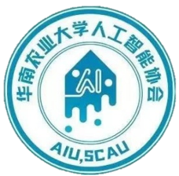
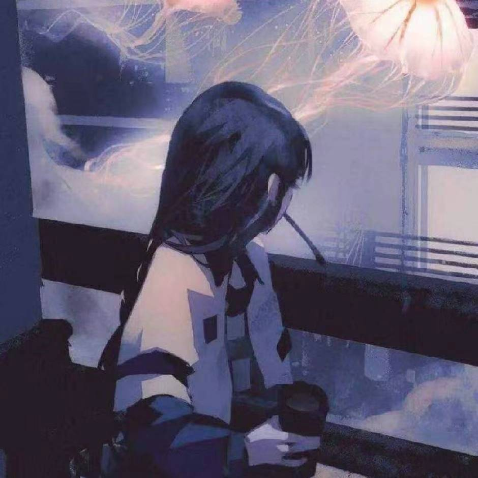

# 睿抗机器人OpenCV培训


<div align="center">
  
  
  华南农业大学人工智能协会 - OpenCV图像处理入门培训

</div>


## 培训说明

本培训面向AI专业大一新生（老登选择性看），旨在通过4-6小时的时间，帮助同学掌握OpenCV基础知识和图像处理基本技能，能够动手实践完成简单的视觉任务。默认你掌握python的基本语法。

## 培训安排

### 基本内容
- ✅ 环境搭建（15分钟）
- ✅ OpenCV基础：读取、显示、保存（30分钟）
- ✅ 图像基本操作：缩放、裁剪、翻转（45分钟）
- ✅ 色彩空间转换（30分钟）
- ✅ 绘制图形与文字（30分钟）

### 实战内容
- ✅ 图像滤波（平滑、锐化）（45分钟）
- ✅ 边缘检测（30分钟）
- ✅ 图像阈值处理（30分钟）
- ✅ 形态学操作（30分钟）
- ✅ 综合实战项目（60-75分钟）

## 项目目录

```
CV培训/
├── docs/                      # 教程文档（看这里学）
│   ├── 00-环境搭建.md
│   ├── 01-OpenCV简介与基础.md
│   ├── 02-图像基本操作.md
│   ├── 03-色彩空间转换.md
│   ├── 04-图像绘制.md
│   ├── 05-图像滤波与增强.md
│   ├── 06-图像阈值处理.md
│   ├── 07-形态学操作.md
│   ├── 08-实战项目教程.md
│   └── 09-常见问题与调试技巧.md
|——toys/                      # 有趣的演示玩法
│
├── tasks/                     # 实践任务（含详任务说明和代码框架）
│   ├── task-01/              # 图像基本操作（缩放、裁剪、翻转、旋转）
│   ├── task-02/              # 色彩空间转换与颜色提取
│   ├── task-03/              # 图像滤波与边缘检测
│   ├── task-04/              # 图像阈值处理
│   ├── task-05/              # 形态学操作与颜色追踪
│   └── final-project/        # 综合项目
│       ├── 项目A：智能文档扫描器
│       ├── 项目B：颜色识别分类器
│       └── 项目C：简易美颜相机
│
├── src/                       # 示例代码与工具库
│   ├── examples/             # Python代码示例
│   │   ├── 01-read-display.py
│   │   ├── 02-basic-operations.py
│   │   ├── 03-color-conversion.py
│   │   ├── 04-drawing.py
│   │   ├── 05-filtering.py
│   │   ├── 06-thresholding.py
│   │   ├── 07-morphology.py
│   │   ├── 08-project-examples.py
│   │   └── 09-video-processing.py
│   ├── templates/            # 代码模板（ImageProcessor类）
│   └── utils/                # 工具函数库
│       ├── display.py        # 图像显示辅助函数
│       ├── image_helpers.py  # 图像处理辅助函数
│       └── io_helpers.py     # 中文路径处理
│
└── assets/                    # 图片资源 （涵盖所有练习场景）
    ├── sample-images/
    │   ├── basic/            # 基础图片 (3张)
    │   ├── colored-objects/  # 彩色物体 (3张)
    │   ├── noisy/            # 含噪图片 (3张)
    │   ├── shapes/           # 几何形状 (3张)
    │   └── real-world/       # 真实场景 (3张)
    ├── test-videos/          # 测试视频（自己添加）
    ├── 生成测试图片.py        # 自动生成测试图片脚本
    ├── 图片资源说明.md       # 详细说明
    └── README.md             # 资源目录说明
```

## 练习列表

- [ ] 阅读 [00-环境搭建](./docs/00-环境搭建.md)
- [ ] 安装Python、OpenCV、Jupyter Notebook
- [ ] 运行测试代码验证安装
- [ ] 完成 [Task 1: 图像基本操作](./tasks/task-01/README.md)
- [ ] 完成 [Task 2: 色彩空间转换](./tasks/task-02/README.md)
- [ ] 完成 [Task 3: 图像滤波](./tasks/task-03/README.md)
- [ ] 完成 [Task 4: 边缘检测](./tasks/task-04/README.md)
- [ ] 完成 [Task 5: 颜色追踪](./tasks/task-05/README.md)
- [ ] 选择并完成 [Final Project](./tasks/final-project/README.md)（三选一）
  - 项目A：智能文档扫描器
  - 项目B：颜色识别分类器
  - 项目C：简易美颜相机

## 学习检查与反馈

### 学习进度检查点
完成本培训后，你应该能够：
- [ ] 熟练使用 OpenCV 读取、显示和保存图像
- [ ] 掌握图像的基本操作（缩放、裁剪、翻转、旋转）
- [ ] 理解并进行色彩空间转换（BGR、RGB、灰度、HSV）
- [ ] 应用图像滤波进行降噪和增强
- [ ] 实现边缘检测和图像阈值处理
- [ ] 使用形态学操作处理二值图像
- [ ] 独立完成一个综合性的图像处理项目

### 反馈与改进建议
- 每完成一个任务，请及时总结遇到的问题和解决方法
- 建议记录学习笔记，方便后续查阅
- 遇到问题可以参考 [09-常见问题与调试技巧](./docs/09-常见问题与调试技巧.md)

## 快速开始

### 1. 环境配置
```bash
pip install opencv-python numpy matplotlib jupyter -i https://pypi.tuna.tsinghua.edu.cn/simple
```

### 2. 验证安装

**方式1：运行Python脚本**
```bash
python src/examples/01-read-display.py
```

### 3. 开始学习
从 [00-环境搭建](./docs/00-环境搭建.md) 开始，按顺序学习教程文档。

**学习方式：**
- **Python脚本**：适合有编程基础的学习者，可以直接运行和修改代码
- **Jupyter Notebook**：推荐！交互式学习环境，可以逐步执行代码单元格，查看实时结果（不过需要你会用）

## 学习资源

- [OpenCV官方文档](https://docs.opencv.org/4.x/)
- [OpenCV Python教程](https://docs.opencv.org/4.x/d6/d00/tutorial_py_root.html)
- 教程文档位于 [docs/](./docs/) 目录
- **示例代码**：
  - Python脚本版本：[src/examples/](./src/examples/)
  - Jupyter Notebook版本：[src/notebooks/](./src/notebooks/) ⭐ 推荐
- **测试图片已生成** - 位于 [assets/](./assets/) 目录（共15张）


**练习任务列表：**
1. `01-read-display` - 图像读取、显示与保存
2. `02-basic-operations` - 图像基本操作（缩放、裁剪、翻转、旋转）
3. `03-color-conversion` - 色彩空间转换与颜色提取
4. `04-drawing` - 绘制图形与文字
5. `05-filtering` - 图像滤波与边缘检测
6. `06-thresholding` - 图像阈值处理
7. `07-morphology` - 形态学操作
8. `08-project-examples` - 综合实战项目
9. `09-video-processing` - 视频处理基础

### 测试图片说明

 **15张测试图片**，涵盖所有练习场景：

| 类别 | 图片 | 用途 |
|-----|------|------|
| 基础图片 | landscape, portrait, text | 读取、显示、基本操作 |
| 彩色物体 | red-apple, blue-ball, mixed-colors | 颜色提取、HSV转换 |
| 含噪图片 | noisy-gaussian, noisy-salt-pepper | 滤波、去噪 |
| 几何形状 | coins, circles, rectangles | 边缘检测、霍夫变换 |
| 真实场景 | document, license-plate, face | 实战项目 |

**重新生成图片：**
```bash
cd assets
python 生成测试图片.py
```

详见 [assets/README.md](./assets/README.md)

## 常见问题

详见 [09-常见问题与调试技巧](./docs/09-常见问题与调试技巧.md)

## 代码质量保证

✅ 所有示例代码包含佛祖保佑注释

### 代码规范
- 遵循 PEP 8 编码规范
- 清晰的分段注释结构
- 详细的中文注释

### 工具库说明
本项目提供三个核心工具库，简化图像处理操作：

**display.py** - 图像显示辅助
- `show_image()` / `show_images()` - 使用matplotlib显示图像
- `show_comparison()` - 创建对比图
- `show_grid()` - 显示图像网格
- `show_histogram()` - 显示直方图
- `interactive_threshold()` - 交互式阈值调整

**image_helpers.py** - 图像处理辅助
- `load_image_or_exit()` - 加载图像失败则退出
- `save_image()` - 保存图像
- `resize_keep_aspect()` - 保持宽高比缩放
- `crop_center()` - 裁剪中心区域
- `add_watermark()` - 添加水印
- `auto_canny()` - 自动Canny边缘检测
- `sort_contours()` - 排序轮廓
- `adjust_brightness_contrast()` - 调整亮度对比度
- `skeletonize()` - 骨架化

**io_helpers.py** - 中文路径处理
- `imread_chinese()` - 读取包含中文路径的图片
- `imwrite_chinese()` - 保存图片到中文路径
- `get_image_path()` - 智能获取图片路径
- `load_image_or_exit()` - 加载图片失败则退出

## 贡献指南
<div align="center">

 

Linmoqian：本培训项目持续完善中，敬请关注，给个star，欢迎提供反馈和建议！

</div>


### 反馈渠道
- 提交 Issue 报告问题
- 提交 PR 改进内容
- 群内分享学习心得和项目作品

## 许可证

本项目用于教学目的，欢迎自由使用和修改。
