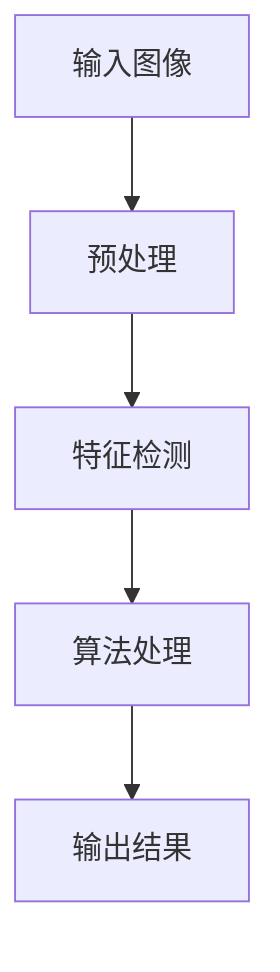

# 📚 期末考核项目 - OpenCV综合应用

> **项目目标**：通过完成一个综合性OpenCV项目，展示你在图像处理、计算机视觉方面的综合能力

**⏰ 提交截止**：Week 3 周日 23:59
**📊 总分**：60分
**🎯 项目选择**：三选一

---

## 📋 目录

- [项目选择指南](#项目选择指南)
- [项目A：智能文档扫描器](#项目a智能文档扫描器)
- [项目B：颜色识别分类器](#项目b颜色识别分类器)
- [项目C：简易美颜相机](#项目c简易美颜相机)
- [评分标准](#评分标准)
- [提交要求](#提交要求)
- [技术报告模板](#技术报告模板)
- [常见问题](#常见问题)
- [参考资料](#参考资料)

---

## 🎯 项目选择指南

### 如何选择适合你的项目？

| 项目 | 难度 | 适合人群 | 核心技术 | 实用性 |
|-----|------|---------|---------|--------|
| **A. 智能文档扫描器** | ⭐⭐⭐ | 逻辑思维强 | 边缘检测、透视变换、图像增强 | ⭐⭐⭐⭐⭐ |
| **B. 颜色识别分类器** | ⭐⭐ | 初学者友好 | HSV色彩空间、轮廓检测、统计分析 | ⭐⭐⭐⭐ |
| **C. 简易美颜相机** | ⭐⭐⭐⭐ | 对实时处理感兴趣 | 视频处理、滤波、人脸检测 | ⭐⭐⭐⭐⭐ |

### 选择建议

- 🎓 **学习优先**：选项目B，最容易上手，概念清晰
- 🔧 **实用优先**：选项目A，技术全面，实用价值高
- 🎨 **创意优先**：选项目C，有趣直观，可扩展性强
- ⚡ **挑战自我**：选项目C，算法复杂度高

---

## 📄 项目A：智能文档扫描器

### 📖 项目描述

实现一个自动文档扫描矫正程序，能够：
- 🔍 自动检测文档边缘
- 📐 矫正透视畸变
- ✨ 增强图像质量
- 💾 生成高质量扫描结果

### 🎯 功能要求与评分

#### 一、基础功能（30分）

| 功能点 | 分值 | 要求 |
|-------|------|------|
| **图像输入与预处理** | 5分 | 支持读取多种图像格式，基本预处理（灰度化、降噪） |
| **边缘检测** | 8分 | 使用Canny边缘检测器，参数调整合理 |
| **轮廓查找** | 8分 | 找到文档轮廓，使用多边形近似获取4个角点 |
| **透视变换** | 9分 | 计算变换矩阵并应用，正确矫正文档 |

**实现要点**：
```python
# 关键步骤
1. 图像预处理：灰度化 → 高斯模糊 → Canny边缘检测
2. 轮廓检测：findContours → 筛选最大轮廓
3. 多边形近似：approxPolyDP → 获取4个角点
4. 透视变换：getPerspectiveTransform → warpPerspective
```

#### 二、进阶功能（15分）

| 功能点 | 分值 | 要求 |
|-------|------|------|
| **自适应阈值** | 5分 | 使用自适应阈值二值化，处理光照不均 |
| **对比度增强** | 5分 | 使用直方图均衡化或CLAHE |
| **图像锐化** | 5分 | 使用拉普拉斯或USM锐化，提升文字清晰度 |

#### 三、扩展功能（10分）

| 功能点 | 分值 | 要求 |
|-------|------|------|
| **批量处理** | 3分 | 支持处理文件夹内所有图片 |
| **参数GUI调整** | 3分 | 使用滑动条调整关键参数 |
| **自动亮度调整** | 2分 | 根据图像亮度自动调整增强参数 |
| **其他创新** | 2分 | 任意有价值的创新功能 |

### 💻 完整代码框架

```python
#!/usr/bin/env python3
# -*- coding: utf-8 -*-
"""
智能文档扫描器
功能：自动检测文档边缘并矫正透视畸变
"""

import cv2
import numpy as np
import os
from pathlib import Path

class DocumentScanner:
    """文档扫描器类"""

    def __init__(self):
        """初始化参数"""
        self.canny_threshold1 = 50
        self.canny_threshold2 = 150
        self.min_contour_area = 10000

    def preprocess(self, image):
        """
        图像预处理
        Args:
            image: 输入图像
        Returns:
            gray: 灰度图
            blurred: 模糊后的图像
        """
        # TODO: 实现灰度化和高斯模糊
        gray = cv2.cvtColor(image, cv2.COLOR_BGR2GRAY)
        blurred = cv2.GaussianBlur(gray, (5, 5), 0)
        return gray, blurred

    def detect_edges(self, image):
        """
        边缘检测
        Args:
            image: 输入图像（灰度图）
        Returns:
            edges: 边缘图像
        """
        # TODO: 使用Canny边缘检测
        edges = cv2.Canny(image, self.canny_threshold1, self.canny_threshold2)
        return edges

    def find_document_contour(self, edges):
        """
        查找文档轮廓
        Args:
            edges: 边缘图像
        Returns:
            contour: 文档轮廓的4个角点
        """
        # TODO: 查找轮廓并筛选
        contours, _ = cv2.findContours(edges, cv2.RETR_EXTERNAL, cv2.CHAIN_APPROX_SIMPLE)

        # 筛选最大轮廓
        if not contours:
            return None

        max_contour = max(contours, key=cv2.contourArea)

        # 多边形近似，获取4个角点
        perimeter = cv2.arcLength(max_contour, True)
        approx = cv2.approxPolyDP(max_contour, 0.02 * perimeter, True)

        # 如果角点数不是4，尝试调整
        if len(approx) != 4:
            # TODO: 处理角点不为4的情况
            return None

        return approx.reshape(4, 2)

    def order_points(self, pts):
        """
        对4个点排序：左上、右上、右下、左下
        Args:
            pts: 4个角点
        Returns:
            rect: 排序后的4个点
        """
        # TODO: 实现点排序逻辑
        rect = np.zeros((4, 2), dtype="float32")

        # 根据x坐标排序
        pts = sorted(pts, key=lambda x: x[0])

        # 左侧两个点：y小的为左上
        left_pts = sorted(pts[:2], key=lambda x: x[1])
        rect[0] = left_pts[0]  # 左上
        rect[3] = left_pts[1]  # 左下

        # 右侧两个点：y小的为右上
        right_pts = sorted(pts[2:], key=lambda x: x[1])
        rect[1] = right_pts[0]  # 右上
        rect[2] = right_pts[1]  # 右下

        return rect

    def perspective_transform(self, image, pts):
        """
        透视变换
        Args:
            image: 原图像
            pts: 文档的4个角点
        Returns:
            warped: 变换后的图像
        """
        # TODO: 计算变换矩阵并应用
        rect = self.order_points(pts)

        # 计算新图像的宽度和高度
        width_a = np.sqrt(((rect[2][0] - rect[3][0]) ** 2) + ((rect[2][1] - rect[3][1]) ** 2))
        width_b = np.sqrt(((rect[1][0] - rect[0][0]) ** 2) + ((rect[1][1] - rect[0][1]) ** 2))
        max_width = max(int(width_a), int(width_b))

        height_a = np.sqrt(((rect[1][0] - rect[2][0]) ** 2) + ((rect[1][1] - rect[2][1]) ** 2))
        height_b = np.sqrt(((rect[0][0] - rect[3][0]) ** 2) + ((rect[0][1] - rect[3][1]) ** 2))
        max_height = max(int(height_a), int(height_b))

        # 目标点
        dst = np.array([
            [0, 0],
            [max_width - 1, 0],
            [max_width - 1, max_height - 1],
            [0, max_height - 1]
        ], dtype="float32")

        # 计算变换矩阵并应用
        M = cv2.getPerspectiveTransform(rect, dst)
        warped = cv2.warpPerspective(image, M, (max_width, max_height))

        return warped

    def enhance_image(self, image):
        """
        图像增强
        Args:
            image: 输入图像
        Returns:
            enhanced: 增强后的图像
        """
        # TODO: 实现图像增强
        # 转换为灰度图
        gray = cv2.cvtColor(image, cv2.COLOR_BGR2GRAY) if len(image.shape) == 3 else image

        # 自适应阈值
        binary = cv2.adaptiveThreshold(
            gray, 255, cv2.ADAPTIVE_THRESH_GAUSSIAN_C,
            cv2.THRESH_BINARY, 11, 2
        )

        # CLAHE对比度增强
        clahe = cv2.createCLAHE(clipLimit=2.0, tileGridSize=(8, 8))
        enhanced = clahe.apply(gray)

        return enhanced, binary

    def scan_document(self, image_path, output_path=None):
        """
        扫描文档的主流程
        Args:
            image_path: 输入图像路径
            output_path: 输出图像路径（可选）
        Returns:
            result: 处理结果
        """
        # 1. 读取图像
        image = cv2.imread(image_path)
        if image is None:
            print(f"错误：无法读取图像 {image_path}")
            return None

        print(f"处理图像: {image_path}")
        print(f"图像尺寸: {image.shape}")

        # 2. 预处理
        original = image.copy()
        gray, blurred = self.preprocess(image)

        # 3. 边缘检测
        edges = self.detect_edges(blurred)

        # 4. 查找文档轮廓
        contour = self.find_document_contour(edges)

        if contour is None:
            print("未检测到文档轮廓，尝试使用全图...")
            result = original
        else:
            print(f"检测到文档轮廓: {contour}")

            # 绘制轮廓（用于可视化）
            cv2.drawContours(image, [contour.astype(int)], -1, (0, 255, 0), 2)

            # 5. 透视变换
            warped = self.perspective_transform(original, contour)

            # 6. 图像增强
            enhanced, binary = self.enhance_image(warped)

            result = {
                'original': original,
                'marked': image,
                'warped': warped,
                'enhanced': enhanced,
                'binary': binary
            }

        # 7. 保存结果
        if output_path:
            output_dir = Path(output_path).parent
            output_dir.mkdir(parents=True, exist_ok=True)
            cv2.imwrite(output_path, enhanced if isinstance(result, dict) else result['enhanced'])
            print(f"结果已保存到: {output_path}")

        return result

    def batch_process(self, input_dir, output_dir):
        """
        批量处理文件夹中的所有图像
        Args:
            input_dir: 输入文件夹
            output_dir: 输出文件夹
        """
        input_path = Path(input_dir)
        output_path = Path(output_dir)
        output_path.mkdir(parents=True, exist_ok=True)

        # 支持的图像格式
        extensions = ['.jpg', '.jpeg', '.png', '.bmp']

        # 处理所有图像
        for ext in extensions:
            for img_file in input_path.glob(f'*{ext}'):
                print(f"\n{'='*50}")
                output_file = output_path / f"scanned_{img_file.name}"
                self.scan_document(str(img_file), str(output_file))


def main():
    """主函数"""
    scanner = DocumentScanner()

    # 单个图像处理
    image_path = input("请输入图像路径: ").strip()
    if not image_path:
        image_path = "assets/test-images/document.jpg"

    output_path = input("请输入输出路径（直接回车跳过保存）: ").strip()
    if not output_path:
        output_path = None

    result = scanner.scan_document(image_path, output_path)

    if result:
        # 显示结果
        if isinstance(result, dict):
            cv2.imshow('Original', result['original'])
            cv2.imshow('Warped', result['warped'])
            cv2.imshow('Enhanced', result['enhanced'])
            cv2.imshow('Binary', result['binary'])
            cv2.waitKey(0)
            cv2.destroyAllWindows()

    # 批量处理（可选）
    choice = input("\n是否批量处理文件夹？(y/n): ").strip().lower()
    if choice == 'y':
        input_dir = input("请输入输入文件夹路径: ").strip()
        output_dir = input("请输入输出文件夹路径: ").strip()
        scanner.batch_process(input_dir, output_dir)


if __name__ == '__main__':
    main()
```

### 🔧 创新点建议

1. **智能边缘检测**：根据图像特点自适应调整Canny参数
2. **多文档检测**：同时检测并矫正多个文档
3. **自动旋转矫正**：检测文字方向并自动旋转
4. **质量评估**：评估扫描质量并给出改进建议
5. **OCR集成**：集成Tesseract OCR提取文字

---

## 🎨 项目B：颜色识别分类器

### 📖 项目描述

实现一个智能颜色识别系统，能够：
- 🎯 识别图像中的多种颜色
- 🔢 统计每种颜色的物体数量
- 📍 标记物体位置
- 📊 生成颜色统计报告

### 🎯 功能要求与评分

#### 一、基础功能（30分）

| 功能点 | 分值 | 要求 |
|-------|------|------|
| **多颜色识别** | 12分 | 支持至少5种颜色（RGB+自定义），正确转换到HSV空间 |
| **颜色阈值定义** | 6分 | 合理定义每种颜色的HSV范围 |
| **物体检测** | 12分 | 使用颜色掩码检测物体，过滤噪声 |

**实现要点**：
```python
# 关键步骤
1. 定义颜色字典：HSV范围（lower, upper）
2. 图像预处理：BGR → HSV转换
3. 颜色掩码：inRange() 获取每种颜色的掩码
4. 形态学操作：开运算/闭运算去噪
5. 轮廓检测：findContours() 查找物体
```

#### 二、进阶功能（15分）

| 功能点 | 分值 | 要求 |
|-------|------|------|
| **可视化标注** | 7分 | 绘制边界框、中心点、颜色标签 |
| **位置坐标** | 4分 | 输出每个物体的中心坐标 |
| **面积统计** | 4分 | 统计每个物体的面积 |

#### 三、扩展功能（10分）

| 功能点 | 分值 | 要求 |
|-------|------|------|
| **实时检测** | 3分 | 使用摄像头实时检测 |
| **自定义颜色** | 3分 | 通过鼠标点击定义新颜色 |
| **轨迹追踪** | 2分 | 追踪物体移动轨迹 |
| **其他创新** | 2分 | 任意有价值的创新功能 |

### 💻 完整代码框架

```python
#!/usr/bin/env python3
# -*- coding: utf-8 -*-
"""
颜色识别分类器
功能：识别并统计图像中不同颜色的物体
"""

import cv2
import numpy as np
import json
from pathlib import Path

class ColorClassifier:
    """颜色分类器类"""

    def __init__(self):
        """初始化颜色定义"""
        # 定义常见颜色的HSV范围
        self.colors = {
            'red': {
                'lower': (0, 120, 70),
                'upper': (10, 255, 255),
                'label': '红色',
                'bgr': (0, 0, 255)
            },
            'green': {
                'lower': (40, 50, 50),
                'upper': (80, 255, 255),
                'label': '绿色',
                'bgr': (0, 255, 0)
            },
            'blue': {
                'lower': (100, 50, 50),
                'upper': (130, 255, 255),
                'label': '蓝色',
                'bgr': (255, 0, 0)
            },
            'yellow': {
                'lower': (20, 100, 100),
                'upper': (40, 255, 255),
                'label': '黄色',
                'bgr': (0, 255, 255)
            },
            'orange': {
                'lower': (10, 100, 100),
                'upper': (20, 255, 255),
                'label': '橙色',
                'bgr': (0, 165, 255)
            }
        }

        # 检测参数
        self.min_area = 100  # 最小物体面积
        self.max_area = 100000  # 最大物体面积

    def preprocess(self, image):
        """
        图像预处理
        Args:
            image: 输入图像
        Returns:
            hsv: HSV色彩空间图像
            blurred: 模糊后的图像
        """
        # TODO: 转换到HSV空间并轻微模糊
        hsv = cv2.cvtColor(image, cv2.COLOR_BGR2HSV)
        blurred = cv2.GaussianBlur(hsv, (5, 5), 0)
        return hsv, blurred

    def create_color_mask(self, hsv_image, color_name):
        """
        创建颜色掩码
        Args:
            hsv_image: HSV图像
            color_name: 颜色名称
        Returns:
            mask: 二值掩码
        """
        # TODO: 创建颜色范围内的掩码
        if color_name not in self.colors:
            return None

        color_range = self.colors[color_name]
        lower = np.array(color_range['lower'])
        upper = np.array(color_range['upper'])

        mask = cv2.inRange(hsv_image, lower, upper)

        # 形态学操作去噪
        kernel = np.ones((5, 5), np.uint8)
        mask = cv2.morphologyEx(mask, cv2.MORPH_OPEN, kernel)
        mask = cv2.morphologyEx(mask, cv2.MORPH_CLOSE, kernel)

        return mask

    def detect_objects(self, mask):
        """
        检测物体
        Args:
            mask: 颜色掩码
        Returns:
            objects: 物体列表，每个物体包含轮廓、面积、中心点
        """
        # TODO: 查找轮廓并筛选
        contours, _ = cv2.findContours(mask, cv2.RETR_EXTERNAL, cv2.CHAIN_APPROX_SIMPLE)

        objects = []
        for contour in contours:
            area = cv2.contourArea(contour)

            # 面积过滤
            if self.min_area < area < self.max_area:
                # 计算中心点
                M = cv2.moments(contour)
                if M['m00'] != 0:
                    cx = int(M['m10'] / M['m00'])
                    cy = int(M['m01'] / M['m00'])
                else:
                    cx, cy = 0, 0

                # 获取边界框
                x, y, w, h = cv2.boundingRect(contour)

                objects.append({
                    'contour': contour,
                    'area': area,
                    'center': (cx, cy),
                    'bbox': (x, y, w, h)
                })

        return objects

    def classify_colors(self, image):
        """
        分类所有颜色
        Args:
            image: 输入图像
        Returns:
            results: 分类结果
        """
        # TODO: 对每种颜色进行检测
        hsv, blurred = self.preprocess(image)

        results = {}
        for color_name in self.colors.keys():
            mask = self.create_color_mask(blurred, color_name)
            objects = self.detect_objects(mask)

            if objects:
                results[color_name] = {
                    'count': len(objects),
                    'objects': objects,
                    'label': self.colors[color_name]['label'],
                    'bgr': self.colors[color_name]['bgr']
                }

        return results

    def visualize(self, image, results):
        """
        可视化结果
        Args:
            image: 原图像
            results: 分类结果
        Returns:
            vis_image: 可视化图像
        """
        # TODO: 在图像上绘制检测结果
        vis_image = image.copy()

        for color_name, color_data in results.items():
            bgr = color_data['bgr']
            label = color_data['label']

            for i, obj in enumerate(color_data['objects']):
                # 绘制边界框
                x, y, w, h = obj['bbox']
                cv2.rectangle(vis_image, (x, y), (x + w, y + h), bgr, 2)

                # 绘制中心点
                cx, cy = obj['center']
                cv2.circle(vis_image, (cx, cy), 3, bgr, -1)

                # 绘制标签
                text = f"{label}-{i+1}"
                cv2.putText(vis_image, text, (x, y - 5),
                           cv2.FONT_HERSHEY_SIMPLEX, 0.5, bgr, 2)

        return vis_image

    def generate_report(self, results):
        """
        生成统计报告
        Args:
            results: 分类结果
        Returns:
            report: 文本报告
        """
        # TODO: 生成详细的统计报告
        report = "=" * 50 + "\n"
        report += "颜色识别统计报告\n"
        report += "=" * 50 + "\n\n"

        total_count = 0
        for color_name, color_data in results.items():
            count = color_data['count']
            label = color_data['label']
            total_count += count

            report += f"{label}:\n"
            report += f"  数量: {count}\n"

            # 详细信息
            for i, obj in enumerate(color_data['objects']):
                report += f"  物体 {i+1}:\n"
                report += f"    面积: {obj['area']:.2f} 像素²\n"
                report += f"    中心: ({obj['center'][0]}, {obj['center'][1]})\n"

            report += "\n"

        report += f"总计: {total_count} 个物体\n"
        report += "=" * 50 + "\n"

        return report

    def add_custom_color(self, color_name, hsv_lower, hsv_upper, label, bgr):
        """
        添加自定义颜色
        Args:
            color_name: 颜色名称（英文键）
            hsv_lower: HSV下界 (H, S, V)
            hsv_upper: HSV上界 (H, S, V)
            label: 中文标签
            bgr: BGR颜色值
        """
        self.colors[color_name] = {
            'lower': hsv_lower,
            'upper': hsv_upper,
            'label': label,
            'bgr': bgr
        }
        print(f"已添加颜色: {label}")

    def pick_color(self, image, x, y):
        """
        从图像中拾取颜色
        Args:
            image: BGR图像
            x, y: 点击坐标
        Returns:
            hsv_value: HSV值
        """
        # 获取点击处的像素值
        bgr = image[y, x]

        # 转换到HSV
        pixel = np.uint8([[bgr]])
        hsv = cv2.cvtColor(pixel, cv2.COLOR_BGR2HSV)
        hsv_value = hsv[0, 0]

        print(f"拾取颜色 BGR: {bgr} → HSV: {hsv_value}")

        return hsv_value

    def process_image(self, image_path, output_path=None):
        """
        处理单张图像
        Args:
            image_path: 输入图像路径
            output_path: 输出图像路径（可选）
        Returns:
            results: 分类结果
        """
        # 读取图像
        image = cv2.imread(image_path)
        if image is None:
            print(f"错误：无法读取图像 {image_path}")
            return None

        print(f"处理图像: {image_path}")

        # 颜色分类
        results = self.classify_colors(image)

        # 可视化
        vis_image = self.visualize(image, results)

        # 生成报告
        report = self.generate_report(results)
        print(report)

        # 保存结果
        if output_path:
            cv2.imwrite(output_path, vis_image)
            print(f"结果已保存到: {output_path}")

        return results, vis_image


def main():
    """主函数"""
    classifier = ColorClassifier()

    # 单张图像处理
    image_path = input("请输入图像路径: ").strip()
    if not image_path:
        image_path = "assets/test-images/colors.jpg"

    output_path = input("请输入输出路径（直接回车跳过保存）: ").strip()
    if not output_path:
        output_path = None

    results, vis_image = classifier.process_image(image_path, output_path)

    if results:
        # 显示结果
        cv2.imshow('Color Detection', vis_image)
        cv2.waitKey(0)
        cv2.destroyAllWindows()

    # 实时检测（可选）
    choice = input("\n是否启动实时检测？(y/n): ").strip().lower()
    if choice == 'y':
        print("启动摄像头，按 'q' 退出...")
        cap = cv2.VideoCapture(0)

        while True:
            ret, frame = cap.read()
            if not ret:
                break

            # 实时检测
            results = classifier.classify_colors(frame)
            vis_frame = classifier.visualize(frame, results)

            cv2.imshow('Real-time Color Detection', vis_frame)

            if cv2.waitKey(1) & 0xFF == ord('q'):
                break

        cap.release()
        cv2.destroyAllWindows()


if __name__ == '__main__':
    main()
```

### 🔧 创新点建议

1. **颜色校准**：根据光照条件自动调整HSV范围
2. **相似颜色合并**：合并相似的颜色类别
3. **颜色学习**：从样本中学习颜色特征
4. **3D位置估算**：估算物体在3D空间的位置
5. **数据库集成**：将检测结果存入数据库

---

## 📸 项目C：简易美颜相机

### 📖 项目描述

实现一个实时美颜相机，能够：
- 🎥 实时视频处理
- ✨ 多种美颜滤镜（磨皮、美白、瘦脸等）
- 🎛️ 参数实时调整
- 📸 拍照保存

### 🎯 功能要求与评分

#### 一、基础功能（30分）

| 功能点 | 分值 | 要求 |
|-------|------|------|
| **摄像头读取** | 5分 | 打开摄像头，流畅显示视频流 |
| **磨皮效果** | 12分 | 使用双边滤波实现磨皮，效果自然 |
| **美白效果** | 8分 | 使用Gamma校正或色彩调整 |
| **滤镜切换** | 5分 | 至少3种滤镜，键盘切换 |

**实现要点**：
```python
# 关键步骤
1. 视频捕获：VideoCapture() 读取摄像头
2. 磨皮算法：bilateralFilter() 或高斯金字塔
3. 美白算法：Gamma校正或色彩空间调整
4. 实时渲染：imshow() 显示结果
```

#### 二、进阶功能（15分）

| 功能点 | 分值 | 要求 |
|-------|------|------|
| **参数调节** | 8分 | 使用滑动条调整美颜强度 |
| **多滤镜叠加** | 7分 | 支持多种滤镜组合使用 |

#### 三、扩展功能（10分）

| 功能点 | 分值 | 要求 |
|-------|------|------|
| **人脸检测** | 3分 | 检测人脸位置，只对脸部区域处理 |
| **拍照保存** | 2分 | 按键拍照并保存 |
| **前后对比** | 2分 | 显示原片和美颜对比 |
| **其他创新** | 3分 | 任意有价值的创新功能 |

### 💻 完整代码框架

```python
#!/usr/bin/env python3
# -*- coding: utf-8 -*-
"""
简易美颜相机
功能：实时视频美颜处理
"""

import cv2
import numpy as np
from datetime import datetime

class BeautyCamera:
    """美颜相机类"""

    def __init__(self):
        """初始化美颜相机"""
        # 打开摄像头
        self.cap = cv2.VideoCapture(0)

        if not self.cap.isOpened():
            raise RuntimeError("无法打开摄像头")

        # 美颜参数
        self.smoothing_strength = 50  # 磨皮强度 (0-100)
        self.whitening_strength = 30  # 美白强度 (0-100)
        self.warmth_strength = 0      # 色温 (0-100)

        # 当前滤镜
        self.current_filter = 0
        self.filter_names = ['原图', '磨皮', '美白', '磨皮+美白', '复古', '冷色调']

        # 是否显示对比
        self.show_comparison = False

        # 人脸检测器（可选）
        self.face_cascade = cv2.CascadeClassifier(
            cv2.data.haarcascades + 'haarcascade_frontalface_default.xml'
        )

        # 创建窗口
        cv2.namedWindow('Beauty Camera')
        self.create_trackbars()

    def create_trackbars(self):
        """创建滑动条"""
        cv2.createTrackbar('Smoothing', 'Beauty Camera', self.smoothing_strength, 100,
                          lambda x: setattr(self, 'smoothing_strength', x))
        cv2.createTrackbar('Whitening', 'Beauty Camera', self.whitening_strength, 100,
                          lambda x: setattr(self, 'whitening_strength', x))
        cv2.createTrackbar('Warmth', 'Beauty Camera', self.warmth_strength, 100,
                          lambda x: setattr(self, 'warmth_strength', x))

    def smooth_skin(self, image, strength):
        """
        皮肤磨皮
        Args:
            image: 输入图像
            strength: 磨皮强度 (0-100)
        Returns:
            smoothed: 磨皮后的图像
        """
        # TODO: 实现磨皮算法
        if strength == 0:
            return image

        # 转换为浮点型
        img_float = image.astype(np.float32) / 255.0

        # 双边滤波
        # 参数根据强度调整
        d = max(3, strength // 10)
        sigma_color = strength / 10.0
        sigma_space = strength / 10.0

        smoothed = cv2.bilateralFilter(img_float, d, sigma_color, sigma_space)

        # 混合原图和磨皮图
        alpha = strength / 100.0
        result = (1 - alpha) * img_float + alpha * smoothed

        return (result * 255).astype(np.uint8)

    def whiten_skin(self, image, strength):
        """
        皮肤美白
        Args:
            image: 输入图像
            strength: 美白强度 (0-100)
        Returns:
            whitened: 美白后的图像
        """
        # TODO: 实现美白算法
        if strength == 0:
            return image

        # Gamma校正
        gamma = 1.0 + (strength / 100.0) * 0.5

        # 构建查找表
        table = np.array([((i / 255.0) ** (1.0 / gamma)) * 255
                         for i in np.arange(0, 256)]).astype("uint8")

        # 应用Gamma校正
        whitened = cv2.LUT(image, table)

        return whitened

    def adjust_warmth(self, image, strength):
        """
        调整色温
        Args:
            image: 输入图像
            strength: 色温强度 (0-100)
        Returns:
            adjusted: 调整后的图像
        """
        # TODO: 实现色温调整
        if strength == 0:
            return image

        # 转换到LAB空间
        lab = cv2.cvtColor(image, cv2.COLOR_BGR2LAB)

        # 调整A通道（增加暖色）
        delta = strength * 0.5
        lab[:, :, 1] = lab[:, :, 1] + delta

        # 转换回BGR
        result = cv2.cvtColor(lab, cv2.COLOR_LAB2BGR)

        return result

    def apply_vintage_filter(self, image):
        """
        复古滤镜
        Args:
            image: 输入图像
        Returns:
            filtered: 滤镜效果
        """
        # TODO: 实现复古滤镜
        # 降低饱和度
        hsv = cv2.cvtColor(image, cv2.COLOR_BGR2HSV)
        hsv[:, :, 1] = hsv[:, :, 1] * 0.7

        # 添加黄色调
        hsv[:, :, 0] = hsv[:, :, 0] * 1.05

        result = cv2.cvtColor(hsv, cv2.COLOR_HSV2BGR)

        return result

    def apply_cool_filter(self, image):
        """
        冷色调滤镜
        Args:
            image: 输入图像
        Returns:
            filtered: 滤镜效果
        """
        # TODO: 实现冷色调滤镜
        # 增加蓝色
        result = image.copy()
        result[:, :, 0] = result[:, :, 0] * 1.1
        result[:, :, 2] = result[:, :, 2] * 0.9

        return np.clip(result, 0, 255).astype(np.uint8)

    def detect_face(self, image):
        """
        检测人脸
        Args:
            image: 输入图像
        Returns:
            faces: 人脸位置列表
        """
        # TODO: 检测人脸
        gray = cv2.cvtColor(image, cv2.COLOR_BGR2GRAY)
        faces = self.face_cascade.detectMultiScale(
            gray, scaleFactor=1.1, minNeighbors=5, minSize=(30, 30)
        )
        return faces

    def apply_filter(self, image, filter_idx):
        """
        应用滤镜
        Args:
            image: 输入图像
            filter_idx: 滤镜索引
        Returns:
            filtered: 滤镜后的图像
        """
        # TODO: 根据索引应用不同滤镜
        if filter_idx == 0:  # 原图
            return image
        elif filter_idx == 1:  # 磨皮
            return self.smooth_skin(image, self.smoothing_strength)
        elif filter_idx == 2:  # 美白
            return self.whiten_skin(image, self.whitening_strength)
        elif filter_idx == 3:  # 磨皮+美白
            smoothed = self.smooth_skin(image, self.smoothing_strength)
            return self.whiten_skin(smoothed, self.whitening_strength)
        elif filter_idx == 4:  # 复古
            return self.apply_vintage_filter(image)
        elif filter_idx == 5:  # 冷色调
            return self.apply_cool_filter(image)
        else:
            return image

    def process_frame(self, frame):
        """
        处理视频帧
        Args:
            frame: 输入帧
        Returns:
            processed: 处理后的帧
        """
        # 应用当前滤镜
        processed = self.apply_filter(frame, self.current_filter)

        # 调整色温
        if self.warmth_strength > 0:
            processed = self.adjust_warmth(processed, self.warmth_strength)

        # 绘制UI信息
        self.draw_ui(processed)

        # 对比模式
        if self.show_comparison:
            # 左右分屏显示
            h, w = processed.shape[:2]
            comparison = np.zeros((h, w * 2, 3), dtype=np.uint8)
            comparison[:, :w] = frame
            comparison[:, w:] = processed

            # 添加标签
            cv2.putText(comparison, 'Original', (10, 30),
                       cv2.FONT_HERSHEY_SIMPLEX, 1, (0, 255, 0), 2)
            cv2.putText(comparison, 'Filtered', (w + 10, 30),
                       cv2.FONT_HERSHEY_SIMPLEX, 1, (0, 255, 0), 2)

            return comparison

        return processed

    def draw_ui(self, image):
        """
        绘制UI信息
        Args:
            image: 图像
        """
        # TODO: 绘制滤镜名称和提示
        h, w = image.shape[:2]

        # 滤镜名称
        filter_name = self.filter_names[self.current_filter]
        cv2.putText(image, f"Filter: {filter_name}", (10, 30),
                   cv2.FONT_HERSHEY_SIMPLEX, 0.8, (255, 255, 255), 2)

        # 操作提示
        tips = "[1-6] Filter  [C] Comparison  [S] Save  [Q] Quit"
        cv2.putText(image, tips, (10, h - 10),
                   cv2.FONT_HERSHEY_SIMPLEX, 0.5, (255, 255, 255), 1)

    def save_photo(self, image):
        """
        保存照片
        Args:
            image: 图像
        """
        # TODO: 保存照片到文件
        timestamp = datetime.now().strftime("%Y%m%d_%H%M%S")
        filename = f"beauty_photo_{timestamp}.jpg"
        cv2.imwrite(filename, image)
        print(f"照片已保存: {filename}")

    def run(self):
        """
        运行美颜相机
        """
        print("美颜相机已启动")
        print("=" * 50)
        print("操作指南:")
        print("  1-6: 切换滤镜")
        print("  C: 显示/隐藏对比")
        print("  S: 保存照片")
        print("  Q: 退出")
        print("=" * 50)

        while True:
            # 读取帧
            ret, frame = self.cap.read()

            if not ret:
                print("无法读取摄像头")
                break

            # 处理帧
            processed = self.process_frame(frame)

            # 显示
            cv2.imshow('Beauty Camera', processed)

            # 键盘控制
            key = cv2.waitKey(1) & 0xFF

            if key == ord('q'):  # 退出
                break
            elif ord('1') <= key <= ord('6'):  # 切换滤镜
                self.current_filter = key - ord('1')
                print(f"切换滤镜: {self.filter_names[self.current_filter]}")
            elif key == ord('c'):  # 对比
                self.show_comparison = not self.show_comparison
            elif key == ord('s'):  # 保存
                self.save_photo(processed)

        # 释放资源
        self.cap.release()
        cv2.destroyAllWindows()
        print("美颜相机已关闭")


def main():
    """主函数"""
    try:
        camera = BeautyCamera()
        camera.run()
    except RuntimeError as e:
        print(f"错误: {e}")
    except KeyboardInterrupt:
        print("\n程序被用户中断")
    except Exception as e:
        print(f"发生错误: {e}")


if __name__ == '__main__':
    main()
```

### 🔧 创新点建议

1. **人脸关键点检测**：使用dlib检测人脸关键点，实现精准美颜
2. **大眼效果**：放大眼睛区域
3. **瘦脸算法**：基于关键点的局部变形
4. **美妆效果**：添加口红、腮红等美妆效果
5. **贴纸特效**：添加可爱贴纸和滤镜
6. **AR滤镜**：实现3D面具和特效

---

## 📊 评分标准

### 总体评分（总分60分）

| 评分维度 | 分值 | 说明 |
|---------|------|------|
| **功能完整性** | 30分 | 基础功能全部实现 |
| **进阶功能** | 15分 | 进阶功能完成度 |
| **代码质量** | 10分 | 代码规范、注释完整 |
| **技术报告** | 5分 | 报告详细程度 |

### 详细评分细则

#### 1. 功能完整性（30分）

| 完成度 | 分值 | 描述 |
|-------|------|------|
| 优秀 | 26-30分 | 所有基础功能完整实现，运行稳定 |
| 良好 | 21-25分 | 大部分功能实现，有小瑕疵 |
| 及格 | 15-20分 | 基本功能实现，有明显不足 |
| 不及格 | 0-14分 | 功能缺失严重 |

#### 2. 进阶功能（15分）

| 完成度 | 分值 | 描述 |
|-------|------|------|
| 优秀 | 13-15分 | 所有进阶功能实现，效果优秀 |
| 良好 | 10-12分 | 大部分进阶功能实现 |
| 及格 | 7-9分 | 部分进阶功能实现 |
| 未完成 | 0-6分 | 进阶功能缺失 |

#### 3. 代码质量（10分）

| 评分项 | 分值 | 评分标准 |
|-------|------|---------|
| **代码结构** | 3分 | 模块化设计，函数划分合理 |
| **注释质量** | 3分 | 注释清晰，中文注释完整 |
| **命名规范** | 2分 | 变量/函数命名符合PEP8 |
| **错误处理** | 2分 | 有基本的异常处理 |

#### 4. 技术报告（5分）

| 评分项 | 分值 | 评分标准 |
|-------|------|---------|
| **内容完整性** | 2分 | 包含所有要求章节 |
| **技术深度** | 2分 | 算法原理说明详细 |
| **图文质量** | 1分 | 截图清晰，排版美观 |

### 扣分项

- **迟交**：每迟交1天扣3分
- **抄袭**：直接抄袭代码得0分
- **未运行**：代码无法运行扣10分以上

### 加分项（最高+5分）

- **创新功能**：独特的创新点 +1-3分
- **用户体验**：优秀的交互体验 +1-2分
- **代码优雅**：特别优秀的代码设计 +1分

---

## 📦 提交要求

### 提交内容清单

```
final-project-submission/
├── src/                    # 源代码目录
│   ├── main.py            # 主程序
│   ├── utils.py           # 工具函数（如有）
│   └── config.py          # 配置文件（如有）
├── test-images/           # 测试图片
│   ├── input/             # 输入图片
│   └── output/            # 输出结果
├── report/                # 技术报告
│   └── report.md/pdf      # 报告文件
├── demo/                  # 演示材料
│   ├── screenshots/       # 运行截图
│   └── video.mp4          # 演示视频（如有）
└── README.md              # 项目说明
```

### 1. 代码要求

#### 必须包含：
- ✅ 完整可运行的源代码
- ✅ 清晰的中文注释
- ✅ 必要的依赖说明（requirements.txt）
- ✅ 错误处理和边界情况考虑

#### 代码规范：
```python
# 推荐的代码结构
import cv2
import numpy as np

class YourProject:
    """项目类"""

    def __init__(self):
        """初始化"""
        pass

    def process(self, image):
        """
        处理图像
        Args:
            image: 输入图像
        Returns:
            result: 处理结果
        """
        pass

def main():
    """主函数"""
    pass

if __name__ == '__main__':
    main()
```

### 2. 技术报告要求

#### 报告结构（见下文模板）

#### 必须包含的内容：
- 📄 项目概述（1页）
- 🔧 核心算法原理（2-3页）
- 💻 关键代码说明（2-3页）
- 📊 测试结果与分析（2-3页）
- 🐛 遇到的问题与解决方案（1-2页）
- 💡 创新点与改进方向（1页）

#### 格式要求：
- PDF或Markdown格式
- 包含必要的流程图、架构图
- 代码截图清晰
- 总字数：2000-3000字

### 3. 演示材料要求

#### 截图要求：
- 至少5张关键步骤截图
- 包含输入输出对比
- 标注清晰

#### 视频要求（项目C必须）：
- 时长：1-3分钟
- 展示主要功能
- MP4格式，清晰流畅

### 4. README.md 要求

```markdown
# 项目名称

## 项目简介
（简要描述项目功能和特点）

## 功能特性
- 功能1：描述
- 功能2：描述
- 功能3：描述

## 环境要求
- Python 3.8+
- OpenCV 4.5+
- NumPy 1.19+

## 安装步骤
```bash
pip install -r requirements.txt
```

## 使用方法
```bash
python main.py
```

## 项目结构
（简要说明目录结构）

## 示例
（包含示例图片或说明）

## 注意事项
（使用时需要注意的事项）

## 作者
（姓名、学号）

## 致谢
（参考资料等）
```

### 提交方式

1. **打包提交**：将所有文件打包为ZIP或RAR
2. **命名格式**：`学号_姓名_项目名称.zip`
3. **提交位置**：按照培训要求提交到指定位置
4. **截止时间**：Week 3 周日 23:59

---

## 📝 技术报告模板

```markdown
# 期末项目技术报告

**项目名称**：[填写你的项目名称]
**项目类型**：[A/B/C]
**学生姓名**：[填写姓名]
**学号**：[填写学号]
**提交日期**：[填写日期]

---

## 一、项目概述

### 1.1 项目背景
（说明为什么选择这个项目，这个项目的应用场景）

### 1.2 项目目标
（列出项目的主要目标和要实现的功能）

### 1.3 技术路线
（简要说明使用的主要技术和方法）

---

## 二、核心算法原理

### 2.1 算法流程图


### 2.2 关键技术说明

#### 2.2.1 技术1：[技术名称]
**原理说明**：
- [详细解释算法原理]
- [数学公式（如有）]

**OpenCV实现**：
```python
# 关键代码
```

#### 2.2.2 技术2：[技术名称]
（同上）

### 2.3 参数设置
（列出关键参数及其设置理由）

---

## 三、系统设计与实现

### 3.1 系统架构
```
[绘制系统架构图，说明模块划分]
```

### 3.2 核心代码说明

#### 3.2.1 函数1：[函数名]
```python
def function_name(param1, param2):
    """
    函数功能说明
    Args:
        param1: 参数1说明
        param2: 参数2说明
    Returns:
        返回值说明
    """
    # 代码实现
```

**设计思路**：[说明为什么这样设计]

#### 3.2.2 函数2：[函数名]
（同上）

### 3.3 难点与解决方案

#### 难点1：[问题描述]
**问题描述**：
[详细描述遇到的问题]

**解决方案**：
[说明如何解决]

**代码实现**：
```python
# 解决方案的关键代码
```

#### 难点2：[问题描述]
（同上）

---

## 四、测试与结果

### 4.1 测试环境
- 硬件配置：[CPU、内存等]
- 软件环境：[操作系统、Python版本、OpenCV版本]
- 测试数据：[测试数据来源和规模]

### 4.2 功能测试

#### 测试1：[测试名称]
**测试目的**：[说明测试目的]
**输入数据**：[描述输入]
**预期结果**：[描述预期输出]
**实际结果**：[描述实际输出]
**测试结论**：✅ 通过 / ❌ 未通过

**截图**：


#### 测试2：[测试名称]
（同上）

### 4.3 性能测试

| 测试项 | 测试结果 | 备注 |
|-------|---------|------|
| 处理速度 | XX ms/帧 | 在XX配置下 |
| 内存占用 | XX MB | 峰值内存 |
| 准确率 | XX% | 在XX测试集上 |

### 4.4 结果分析
（分析测试结果，说明项目的优缺点）

---

## 五、创新点与特色

### 5.1 创新点1：[创新点名称]
**创新内容**：[详细说明]
**实现方法**：[说明如何实现]
**效果对比**：


### 5.2 创新点2：[创新点名称]
（同上）

### 5.3 特色功能
（列举项目的特色功能）

---

## 六、问题与改进

### 6.1 已知问题
1. **问题1**：[描述问题]
   - 影响：[说明影响范围]
   - 临时解决方案：[说明临时方案]

2. **问题2**：[描述问题]
   - 影响：[说明影响范围]
   - 临时解决方案：[说明临时方案]

### 6.2 改进方向

#### 短期改进
1. [改进项1]：[说明改进内容和预期效果]
2. [改进项2]：[说明改进内容和预期效果]

#### 长期改进
1. [改进项1]：[说明改进内容和预期效果]
2. [改进项2]：[说明改进内容和预期效果]

---

## 七、心得体会

### 7.1 技术收获
（总结在技术上获得了哪些收获）

### 7.2 项目经验
（总结项目开发中的经验教训）

### 7.3 未来展望
（对未来的学习和项目开发的展望）

---

## 八、参考文献

1. [文献1] OpenCV官方文档, https://docs.opencv.org/
2. [文献2] [参考资料]
3. [文献3] [参考资料]

---

## 附录

### 附录A：完整源代码
（如代码较短可附在报告后）

### 附录B：配置文件
（如有）

### 附录C：额外说明
（其他需要说明的内容）
```

---

## ❓ 常见问题

### 项目相关问题

#### Q1: 三个项目哪个最容易拿高分？
**A**: 难度不是唯一因素，评分标准主要看：
- ✅ 功能完整性（基础功能必须完成）
- ✅ 代码质量（清晰规范）
- ✅ 技术报告（详细认真）

建议选择自己最感兴趣、最能发挥的项目。

#### Q2: 可以做项目之外的内容吗？
**A**: 可以！在完成选定项目的基础功能上，可以：
- 🔀 混合多个项目的功能
- 💡 提出自己的创新想法
- 🎯 联系实际应用场景

但必须确保基础功能完整。

#### Q3: 必须使用OpenCV吗？能用其他库吗？
**A**:
- ✅ 核心功能必须使用OpenCV
- ✅ 可以使用numpy、matplotlib等辅助库
- ⚠️ 不建议使用深度学习库（本次培训重点是传统方法）
- ⚠️ 如需特殊库，请先询问

### 开发相关问题

#### Q4: 遇到报错怎么办？
**A**: 按以下步骤排查：
1. 🔍 检查错误信息，定位问题
2. 📚 查阅教程文档和相关资料
3. 💬 在群里提问，附上：
   - 完整错误信息
   - 相关代码片段
   - 已尝试的解决方法
4. 🕐 参加答疑时间

#### Q5: 代码可以参考网上吗？
**A**:
- ✅ 可以参考思路和算法
- ✅ 必须自己实现核心代码
- ⚠️ 在报告中必须注明参考来源
- ❌ 严禁直接复制粘贴代码

#### Q6: 如何提高代码质量？
**A**: 遵循以下原则：
- 📝 模块化设计，函数职责单一
- 💬 添加清晰的中文注释
- 📋 遵循PEP8命名规范
- 🧪 测试边界情况和异常输入
- 🎨 保持代码简洁优雅

### 提交相关问题

#### Q7: 迟交会扣分吗？
**A**: 是的：
- ⏰ 每迟交1天扣3分
- ⏰ 迟交超过3天不予接受
- ⚠️ 如有特殊情况，请提前说明

#### Q8: 可以补交或修改吗？
**A**:
- ❌ 截止后不接受修改
- ✅ 如发现重大bug，可在截止前重新提交
- 📧 以最后一次提交为准

#### Q9: 技术报告必须写吗？
**A**: 是的！技术报告是评分的重要组成部分：
- 📊 占5分
- 📝 帮助整理思路
- 💡 展示你的理解和分析能力

### 技术相关问题

#### Q10: 项目A中如何处理光照不均？
**A**: 多种方法：
1. 自适应阈值：`cv2.adaptiveThreshold()`
2. CLAHE：限制对比度自适应直方图均衡化
3. 伽马校正：调整亮度
4. 同态滤波：频域处理

#### Q11: 项目B中如何提高颜色识别准确率？
**A**: 建议：
1. 调整HSV范围，参考颜色表
2. 形态学操作去噪
3. 面积阈值过滤
4. 光照条件标准化
5. 实验调参

#### Q12: 项目C中磨皮效果不自然怎么办？
**A**: 优化建议：
1. 调整双边滤波参数
2. 混合原图和磨皮图
3. 只对人脸区域处理
4. 使用高斯金字塔
5. 尝试不同的磨皮算法

---

## 📚 参考资料

### OpenCV官方文档
- 📖 [OpenCV官方文档](https://docs.opencv.org/)
- 📖 [OpenCV中文教程](https://opencv-python-tutroals.readthedocs.io/)
- 📖 [OpenCV-Python教程](https://www.learnopencv.com/)

### 项目A相关
- 📄 [透视变换详解](https://docs.opencv.org/4.x/da/d54/group__imgproc__transform.html)
- 📄 [边缘检测算法](https://docs.opencv.org/4.x/dd/d1a/group__imgproc__feature.html)
- 📄 [文档扫描实战](https://www.pyimagesearch.com/2014/09/01/build-kick-ass-mobile-document-scanner-just-5-minutes/)

### 项目B相关
- 📄 [HSV色彩空间](https://docs.opencv.org/4.x/de/d25/imgproc_color_conversions.html)
- 📄 [颜色检测教程](https://docs.opencv.org/4.x/df/d9d/tutorial_py_colorspaces.html)
- 📄 [轮廓查找](https://docs.opencv.org/4.x/d3/dc0/group__imgproc__shape.html)

### 项目C相关
- 📄 [双边滤波](https://docs.opencv.org/4.x/d4/d86/group__imgproc__filter.html)
- 📄 [视频处理](https://docs.opencv.org/4.x/dd/d43/tutorial_py_video_display.html)
- 📄 [人脸检测](https://docs.opencv.org/4.x/d2/d99/group__objdetect.html)

### 学习资源
- 🎓 [廖雪峰Python教程](https://www.liaoxuefeng.com/wiki/1016959663602400)
- 🎓 [NumPy快速入门](https://numpy.org/doc/stable/user/quickstart.html)
- 🎓 [Python图像处理](https://www.pyimagesearch.com/)

### 示例代码
- 💻 本项目示例代码：`D:\project\CV_AIU\src\examples\`
- 💻 08-project-examples.py：项目示例代码
- 💻 09-video-processing.py：视频处理示例

---

## 🎉 祝你项目成功！

**记住**：
- 📅 合理规划时间
- 💪 逐步实现功能
- 🐛 遇到问题及时提问
- 📝 认真撰写报告

**优秀作品将获得**：
- 🏆 协会证书
- 📱 公众号展示
- 🎁 精美礼品
- 🚀 推荐参加更高级别比赛

**加油！期待看到你的精彩作品！** 🌟
